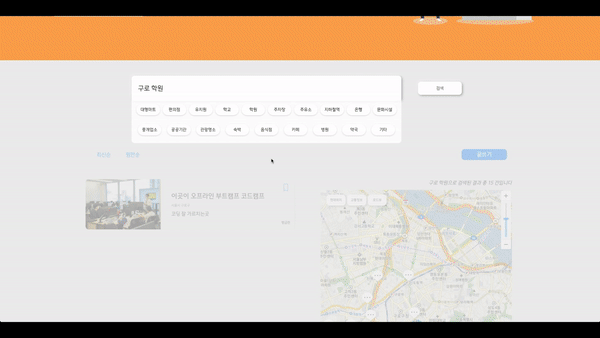

## Slipper
이직, 결혼, 자취 등의 이유로 자신이 살던 동네가 아닌 타지로의 이사를 준비하지만

시간적, 물리적인 제약에 의해 이사 갈 동네의 인프라를 직접 경험하기에는 시간이 부족하다.

그런 사람들을 위해 준비한 <b>“찐 로컬들이 직접 겪어본 자신의 동네의 인프라와 정보를 공유”</b>하는 커뮤니티 서비스!

 

 

---

### Stack
         

---

### Dataflow

---

### Database Schema

---

### API Docs

